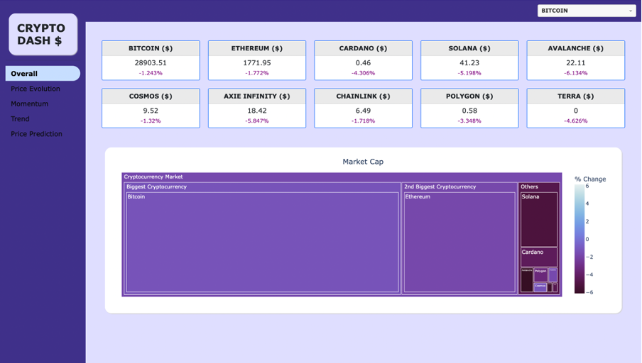

# Group L: Cryptocurrency Data Visualization

To run our app, follow the link: https://bc5-group-l.herokuapp.com

The dashboard contains data updated in real-time, using yfinance
Predicted prices for each cryptocurrency are also included in the dashboard
We also performed a technical analysis to evaluate the momentum and the trend

In this project, it was asked to build a dashboard using any Python-based tool 
for Warner Buffer and Gil Bates, partners of Investments4Some, so it can be used by 
their financial analysts. This dashboard is expected to be flexible, fetching daily 
updated data about their crypto assets, and they expect to use it to inform the 
investment decisions of their internal financial team and external stakeholders. On the 
dashboard are included predictions on the cryptocurrency’s prices for the next day 
and, to keep the dashboard as complete as possible, two technical indicators were 
also included.

Given that no data was provided in this project, all the data presented in the dashboard 
is updated on a daily basis using yfinance, a tool that allows to extract of data in real-time. Note we only used a one-year period to create our dashboard and visualizations. 
Besides that, our dashboard focuses only on the ten cryptocurrencies studied in the 
previous work. To extract the market cap values of each coin, we also used yfinance.

To build the dashboard we used 
Spyder and the visualizations were all 
constructed using Plotly, a dash 
package.

Below, we see a screenshot of the dashboard's first page:

